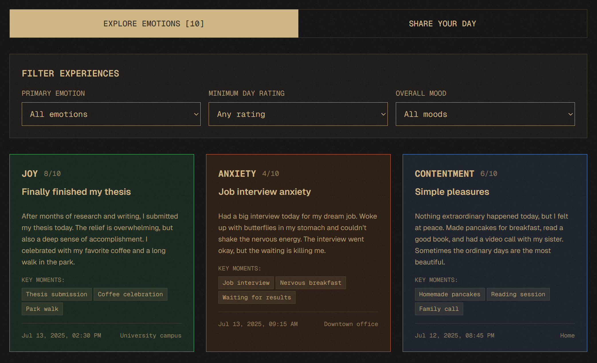
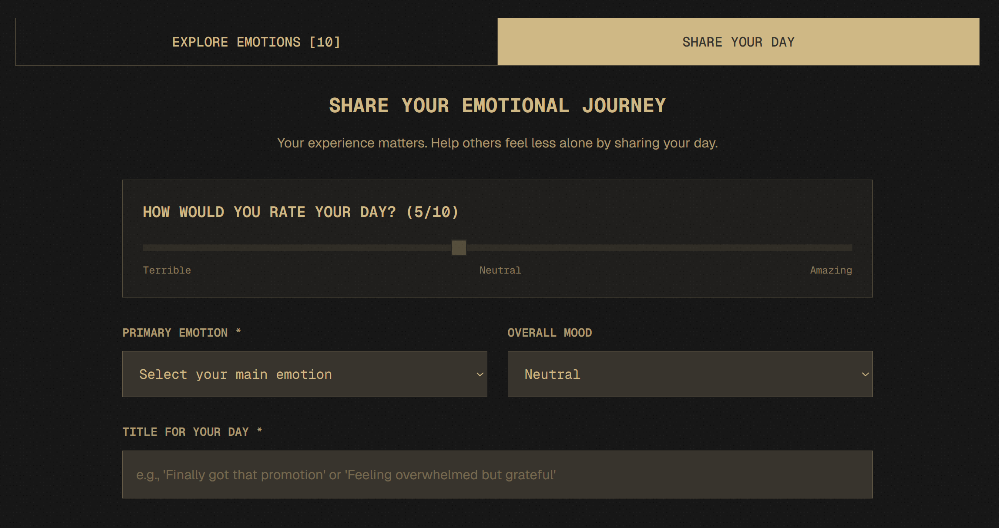
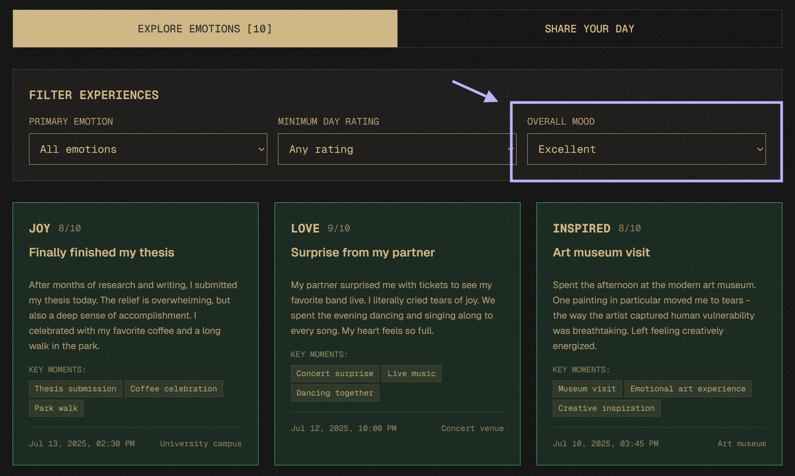

# 💟 THE HUMAN ATLAS

**THE HUMAN ATLAS** is a collective library of human emotions - a private, anonymous space where people can map their emotional landscape, share their daily experiences, and explore the universal human condition through authentic stories.

## 🌟 Key Features

- **Anonymous Sharing**: A safe, private space to express your feelings and reflect on your day
- **Emotion Exploration**: Browse and connect with others through shared emotional experiences
- **Daily Reflections**: Share your day and contribute to the collective emotional landscape
- **Privacy First**: No personal data collection or storage

[](https://shipwrecked.hackclub.com/?t=ghrm)

## 📱 Screenshots

| Explore | Record | Insights |
|---------|---------|----------|
|  |  |  |

## 🛠️ Tech Stack

- [Next.js](https://nextjs.org/) - React framework for production
- [TailwindCSS](https://tailwindcss.com/) - Utility-first CSS framework
- [Supabase](https://supabase.com) - Open source Firebase alternative

## 🧑‍💻 Local Setup Instructions

1. Ensure you have Node.js and pnpm/yarn/npm installed.

```bash
# Clone the repository
git clone https://github.com/shashwtd/the-human-atlas.git
cd the-human-atlas

# Install dependencies
pnpm install

# Run the dev server
pnpm dev
```

1. Open [http://localhost:3000](http://localhost:3000) in your browser

## 🤝 Contributing

Contributions are welcome! Please feel free to submit a Pull Request.
